# PBS News: Data Reporting + Visualizations

🌎 <a href="https://www.instagram.com/p/DCaXTLlsWBe/?img_index=1">U.S. had world's biggest drop in emissions from 2022-2023</a>- Data & graphic visualizations:

<a href="https://www.instagram.com/p/DCaXTLlsWBe/?img_index=1">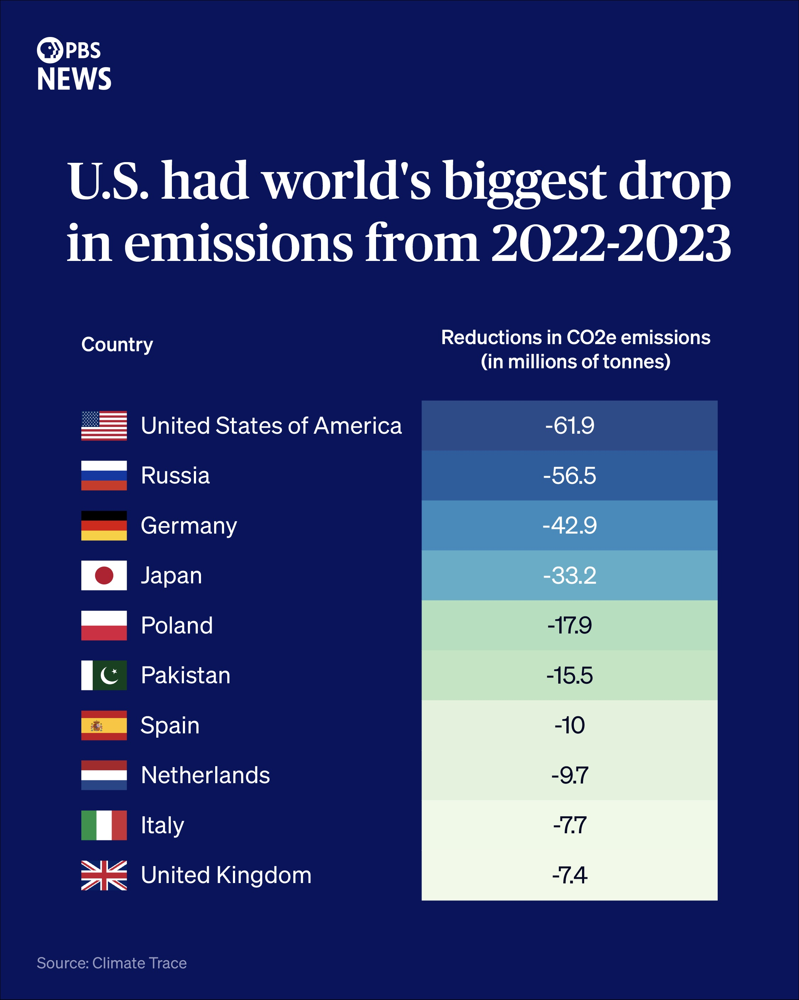</kbd></a>

🇺🇸 <a href="https://www.instagram.com/p/DCFjEVHvC_V/">How different groups voted for president in 2024</a>- Data & graphic visualizations:

<a href="https://www.instagram.com/p/DCFjEVHvC_V/">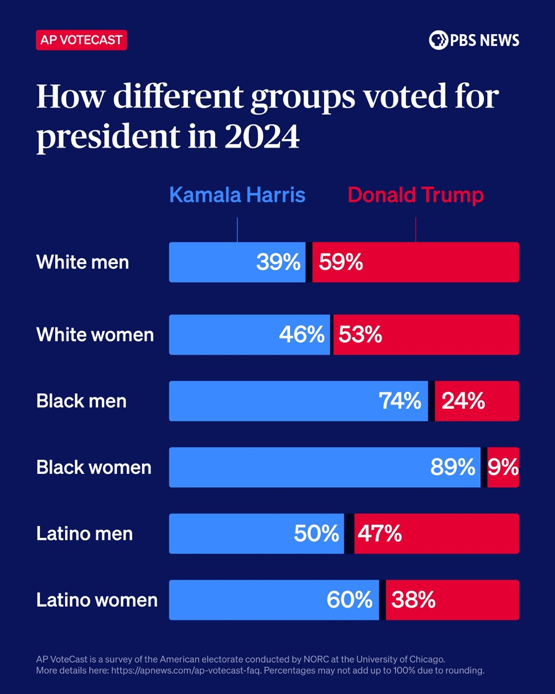</kbd></a>

🇺🇸 <a href="https://www.instagram.com/p/DB-DG1APyOb/?img_index=1">Harris cuts into Trump's lead among male voters</a>- Data & graphic visualizations:

<a href="https://www.instagram.com/p/DB-DG1APyOb/?img_index=1">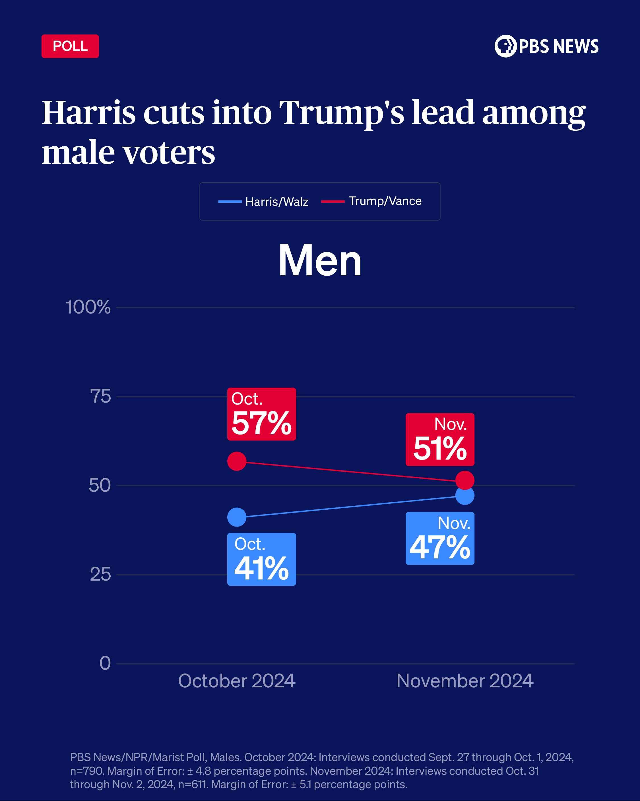</kbd></a>

🇺🇸 <a href="https://www.instagram.com/p/DB9Sk0Ut3AM/">Harris has 4-point lead over Trump in final PBS News/NPR/Marist election poll</a>- Data & graphic visualizations:

<a href="https://www.instagram.com/p/DB9Sk0Ut3AM/">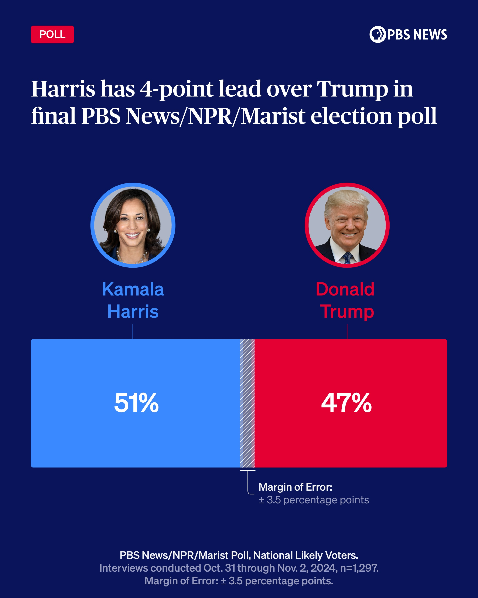</kbd></a>

🌀 <a href="https://www.pbs.org/newshour/nation/live-map-helene">Live Map: Track the path of Hurricane Helene</a>- Interactive data visualization:

<a href="https://www.pbs.org/newshour/nation/live-map-helene">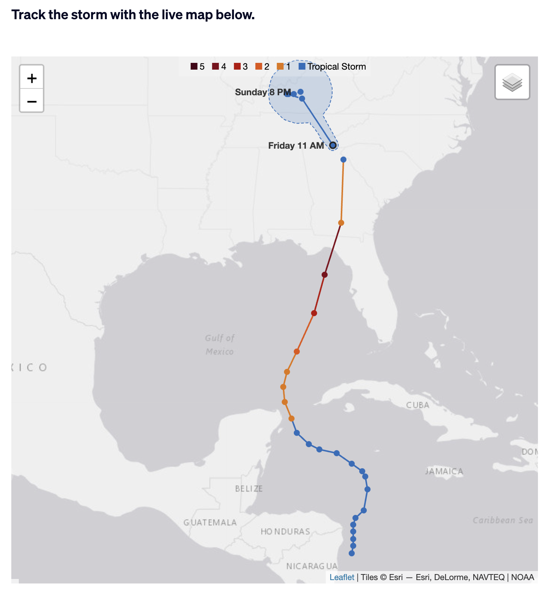</kbd></a>

🇺🇸 <a href="https://www.pbs.org/newshour/politics/poll-harris-narrowly-leads-trump-but-hes-ahead-with-these-key-groups">Poll: Harris narrowly leads Trump, but he’s ahead with these key groups</a>- Data & graphic visualizations:

<a href="https://www.pbs.org/newshour/politics/poll-harris-narrowly-leads-trump-but-hes-ahead-with-these-key-groups">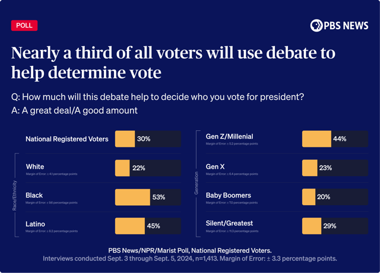</kbd></a>

🇺🇸 <a href="https://www.pbs.org/newshour/politics/before-harris-vp-pick-how-americans-feel-about-possible-running-mates">Harris VP pick: Here’s how Americans feel about Tim Walz </a>- Data & graphic visualizations:

<a href="https://www.pbs.org/newshour/politics/before-harris-vp-pick-how-americans-feel-about-possible-running-mates">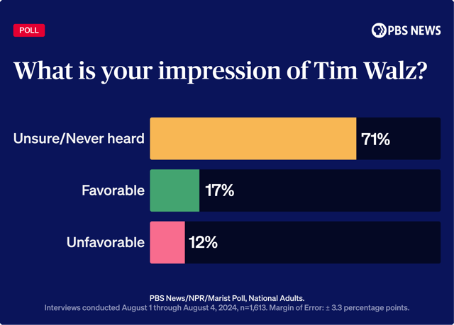</kbd></a>

🇺🇸 <a href="https://www.pbs.org/newshour/politics/majority-of-americans-dont-want-biden-as-the-democratic-candidate-but-he-hasnt-lost-ground-to-trump-poll-says ">These 3 Democrats didn’t do better than Biden in this poll against Trump. They also didn’t do any worse </a>- Data & graphic visualizations:

<a href="https://www.pbs.org/newshour/politics/majority-of-americans-dont-want-biden-as-the-democratic-candidate-but-he-hasnt-lost-ground-to-trump-poll-says ">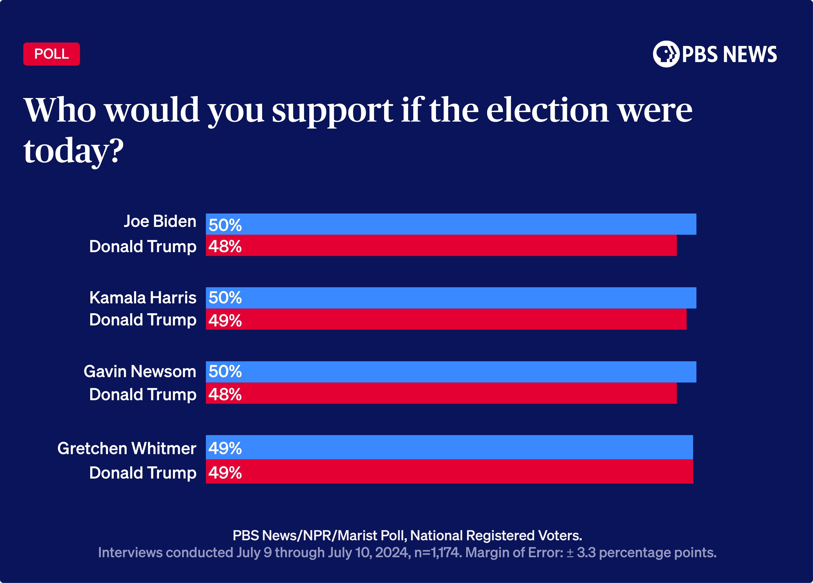</kbd></a>

🇺🇸 <a href="https://www.pbs.org/newshour/politics/heres-how-americans-feel-about-biden-and-trump-as-election-season-revs-up ">Here’s how Americans feel about Biden and Trump as election season revs up </a>- Data & graphic visualizations:

<a href="https://www.pbs.org/newshour/politics/heres-how-americans-feel-about-biden-and-trump-as-election-season-revs-up ">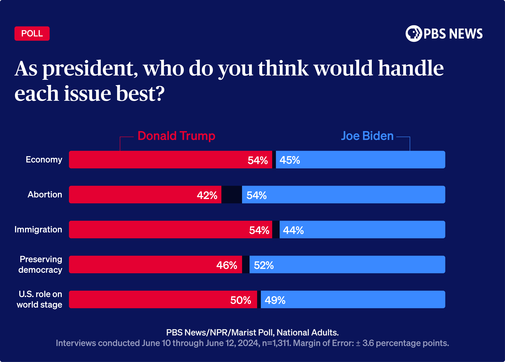</kbd></a>

🤒 <a href="https://www.pbs.org/newshour/health/what-you-need-to-know-about-the-latest-outbreak-of-dengue-fever ">What you need to know about the latest outbreak of dengue fever </a>- Data & graphic visualizations:

<a href="https://www.pbs.org/newshour/health/what-you-need-to-know-about-the-latest-outbreak-of-dengue-fever ">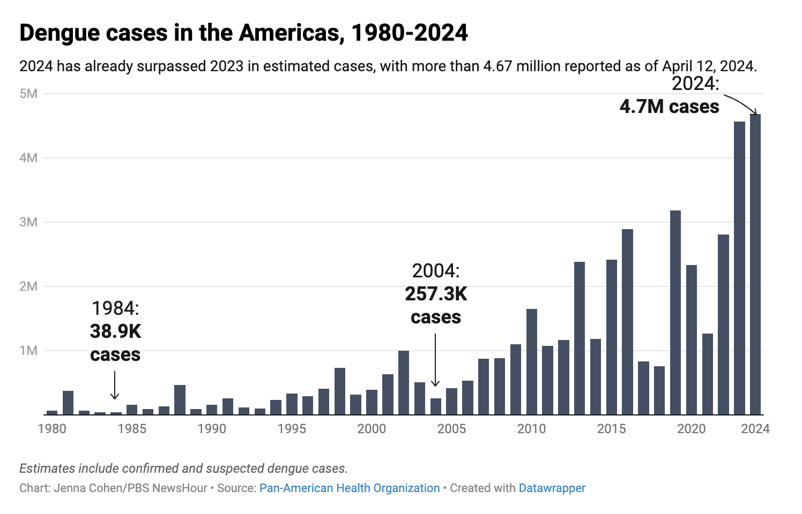</kbd></a>

🇺🇸 <a href="https://www.pbs.org/newshour/politics/1-in-5-americans-think-violence-may-solve-u-s-divisions-poll-finds">1 in 5 Americans think violence may solve U.S. divisions, poll finds </a>- Data & graphic visualizations:

<a href="https://www.pbs.org/newshour/politics/1-in-5-americans-think-violence-may-solve-u-s-divisions-poll-finds">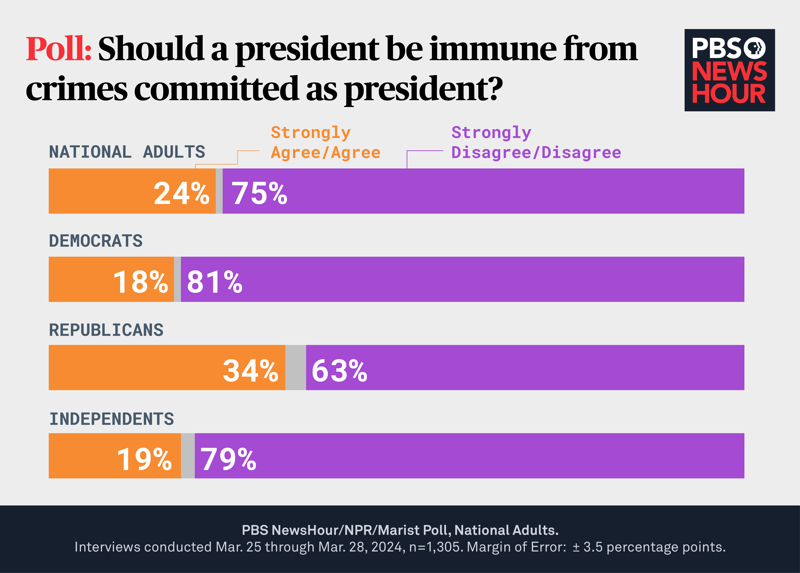</kbd></a>

🎞 <a href="https://youtu.be/vEMIBglapVM">2024 Motion Showreel</a>- Animated data visualizations:

<a href="https://youtu.be/vEMIBglapVM"></kbd></a>

🇺🇸 <a href="https://www.pbs.org/newshour/politics/where-voters-stand-on-immigration">Americans are increasingly worried about immigration and national identity, poll shows </a>- Data & graphic visualizations:

<a href="https://www.pbs.org/newshour/politics/where-voters-stand-on-immigration"><kbd>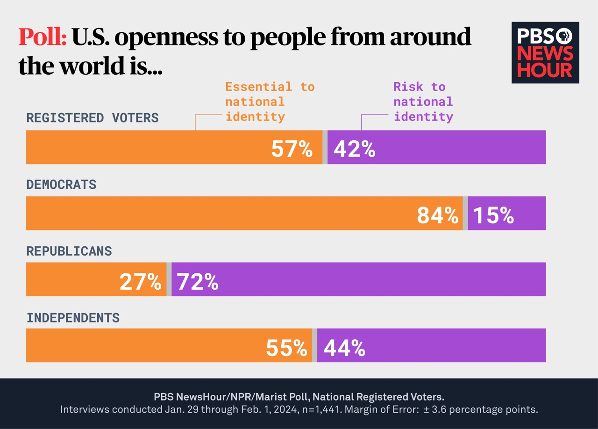</kbd></a>

🌡 <a href="https://www.instagram.com/p/C15hEpVtnSW/">2023 was the hottest year on record </a>- Data & graphic visualizations:

<a href="https://www.instagram.com/p/C15hEpVtnSW/"><kbd>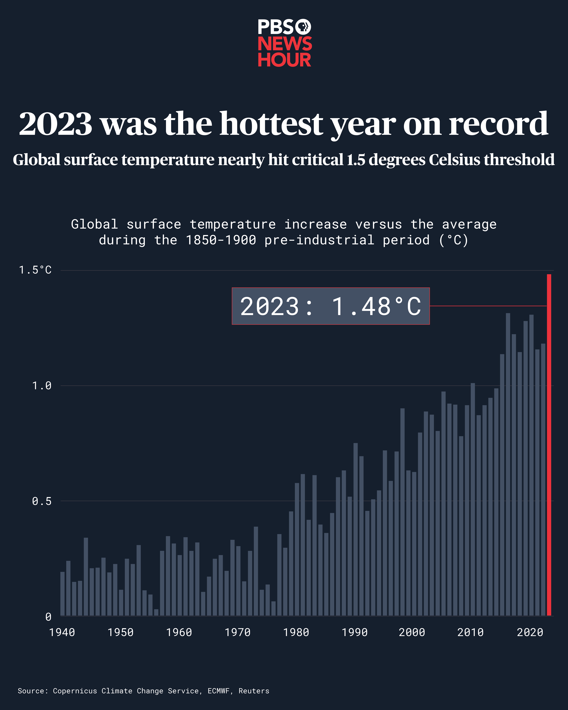</kbd></a>

🫄 <a href="https://www.pbs.org/newshour/health/support-for-abortion-rights-has-grown-in-spite-of-bans-and-restrictions-poll-shows">Support for abortion rights has grown, poll shows </a>- Data & graphic visualizations:

<a href="https://www.pbs.org/newshour/health/support-for-abortion-rights-has-grown-in-spite-of-bans-and-restrictions-poll-shows"><kbd>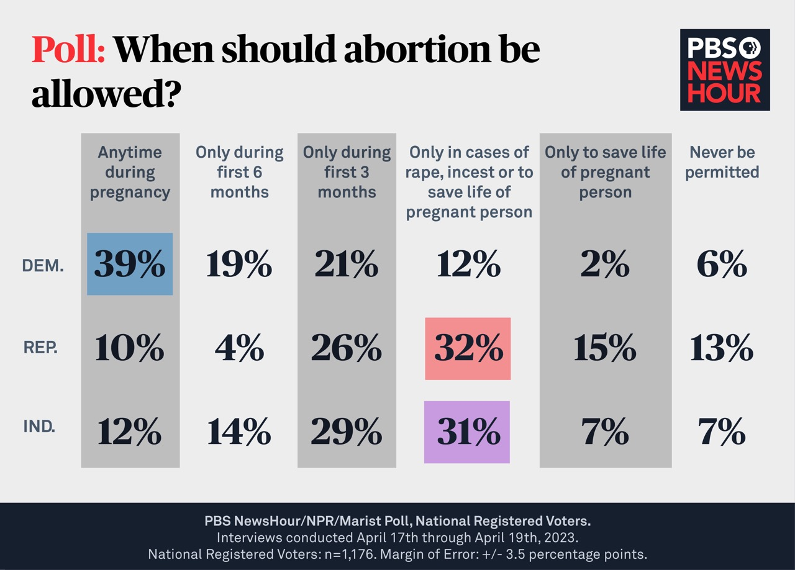</kbd></a>

🇺🇸 <a href="https://www.pbs.org/newshour/politics/as-biden-runs-for-president-again-4-in-10-americans-say-hes-done-a-good-job">2024 election poll </a>- Data & graphic visualizations:

<a href="https://www.pbs.org/newshour/politics/as-biden-runs-for-president-again-4-in-10-americans-say-hes-done-a-good-job"><kbd>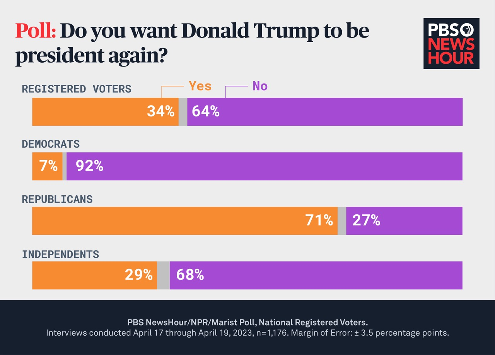</kbd></a>

📚 <a href="https://www.pbs.org/newshour/arts/how-many-book-bans-were-attempted-in-your-state-use-this-map-to-find-out">How many book bans were attempted in your state? </a>- Data reporting:

<a href="https://www.pbs.org/newshour/arts/how-many-book-bans-were-attempted-in-your-state-use-this-map-to-find-out"><kbd>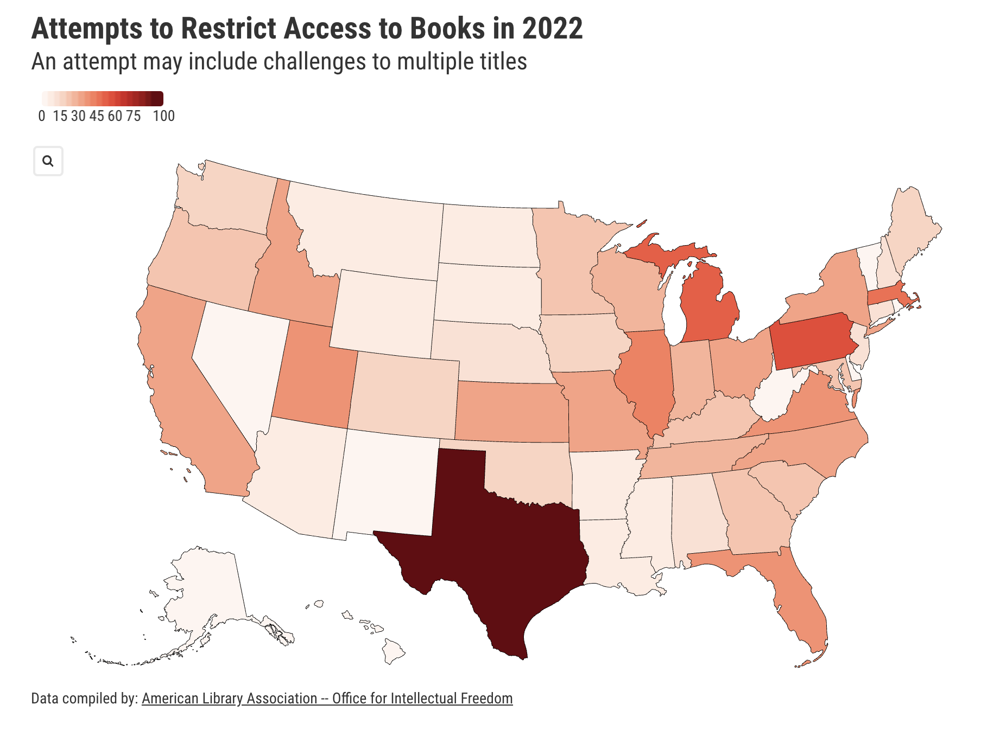</kbd></a>

🗳️ <a href="https://www.pbs.org/newshour/politics/why-should-you-care-about-your-secretary-of-state">How your secretary of state affects elections and why you should care</a>- Data reporting & visualization:

<a href="https://www.pbs.org/newshour/politics/why-should-you-care-about-your-secretary-of-state"><kbd>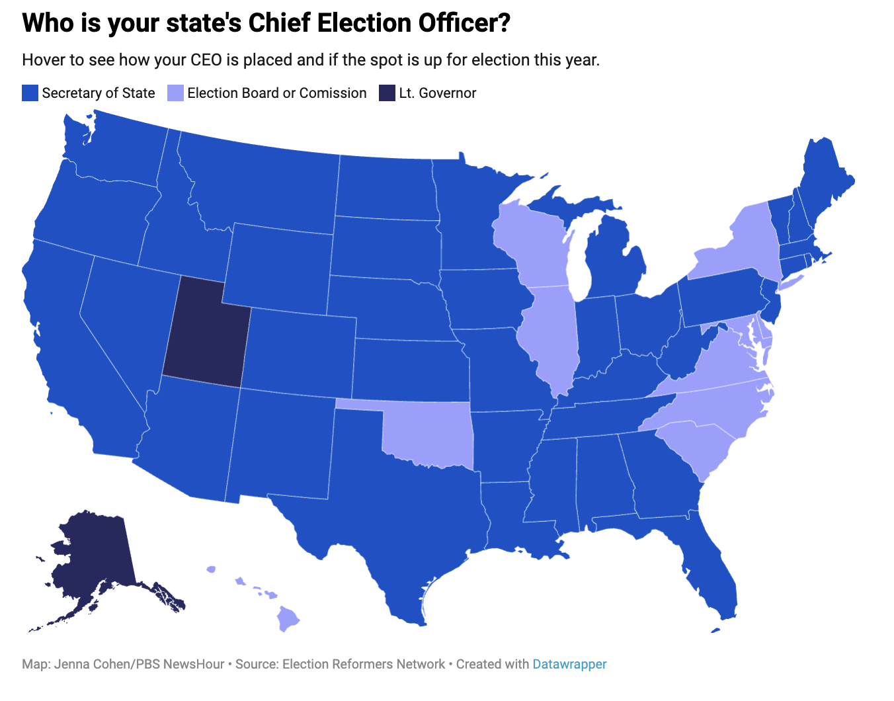</kbd></a>

🗳️ <a href="https://www.pbs.org/newshour/politics/who-runs-elections-in-your-state-use-our-map-to-find-out">Who runs elections in your state? Use our map to find out</a>- Data reporting & visualization:

<a href="https://www.pbs.org/newshour/politics/who-runs-elections-in-your-state-use-our-map-to-find-out"><kbd>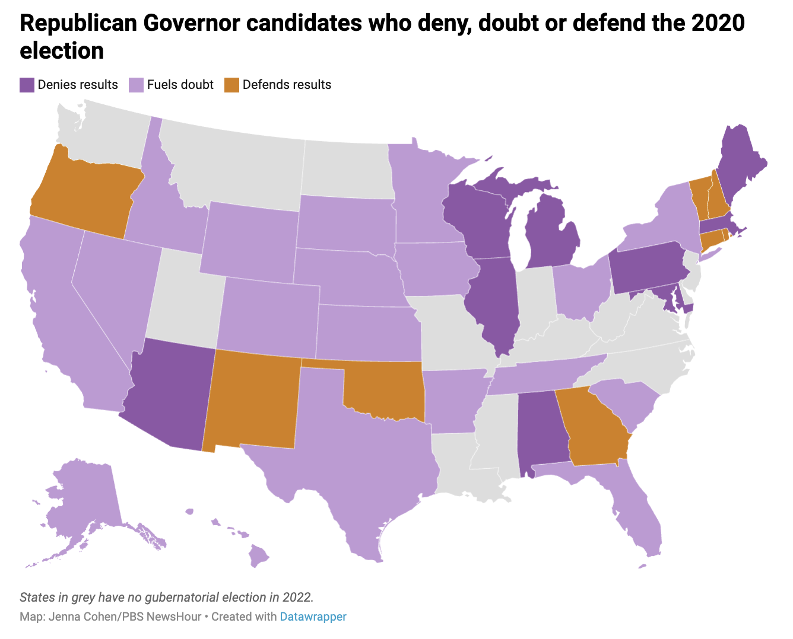</kbd></a>

🫄 <a href="https://www.pbs.org/newshour/nation/how-south-dakota-voters-could-help-save-the-lives-of-uninsured-moms">Here’s what the pregnant and uninsured face in South Dakota </a>- Data visualization & page design:

<a href="https://www.pbs.org/newshour/nation/how-south-dakota-voters-could-help-save-the-lives-of-uninsured-moms"><kbd>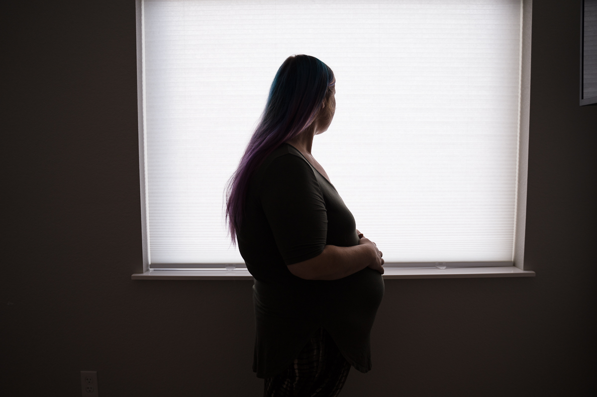</kbd></a>

🇺🇸 <a href="https://www.pbs.org/newshour/politics/the-state-of-our-union-in-6-charts">State of the Union: 6 key issues </a>- Data & graphic visualizations:

<a href="https://www.pbs.org/newshour/politics/the-state-of-our-union-in-6-charts"><kbd>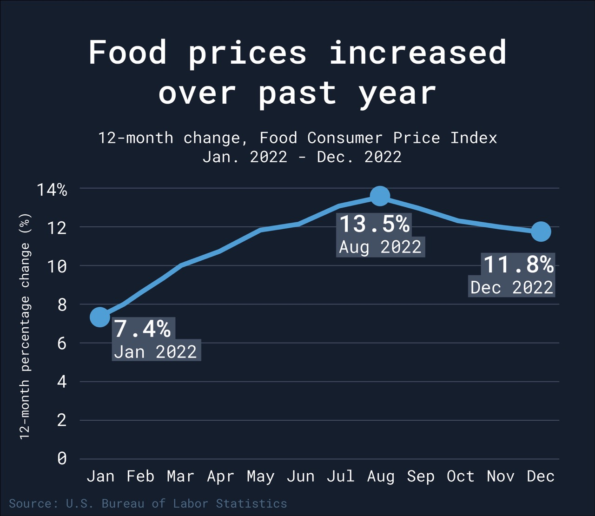</kbd></a>

📈 <a href="https://www.instagram.com/p/Cnxo1LIpqhL/">U.S. gun sales </a>- Data & graphic visualizations:

<a href="https://www.instagram.com/p/Cnxo1LIpqhL/"><kbd>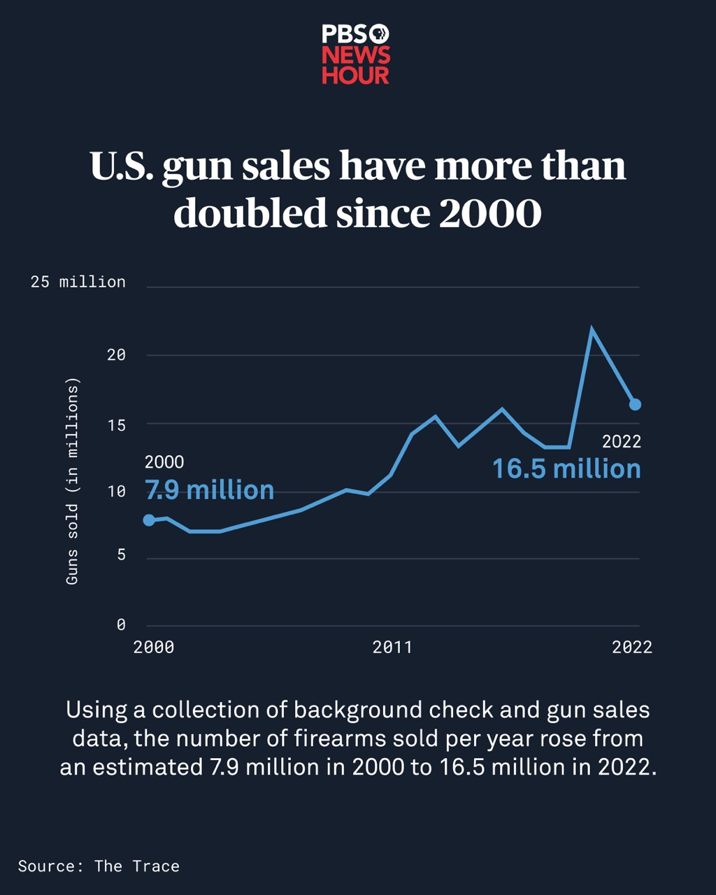</kbd></a>

💡 <a href="https://www.pbs.org/newshour/nation/californias-electricity-demand-breaks-all-time-record-during-severe-heat-wave">California’s electricity demand breaks all-time record </a>- Data & graphic visualizations:

<a href="https://www.pbs.org/newshour/nation/californias-electricity-demand-breaks-all-time-record-during-severe-heat-wave">
  <kbd>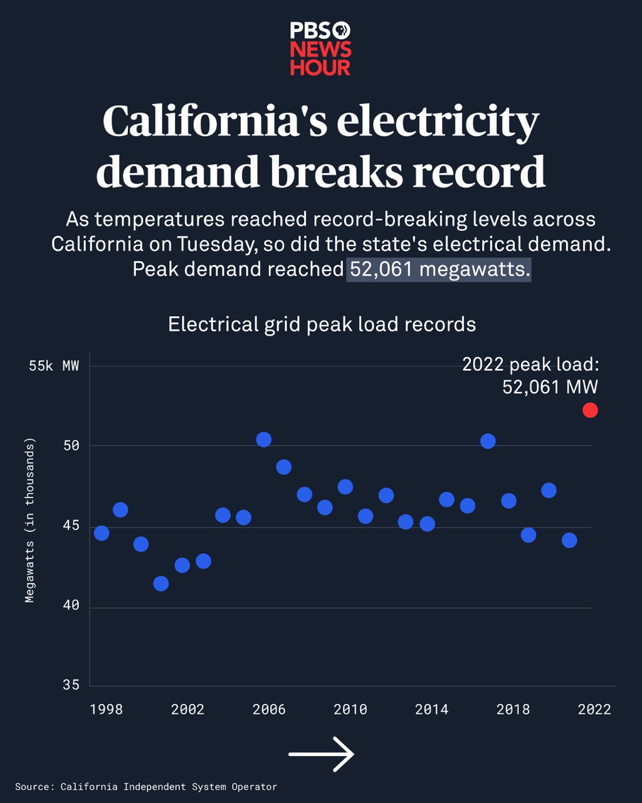</kbd>
</a>

📈 <a href="https://www.pbs.org/newshour/economy/these-2-economists-are-optimistic-about-the-future-of-the-economy-heres-why">2 economists on where the U.S. economy is headed now </a>- Still & animated data visualizations:

<a href="https://www.pbs.org/newshour/economy/these-2-economists-are-optimistic-about-the-future-of-the-economy-heres-why">
  <kbd>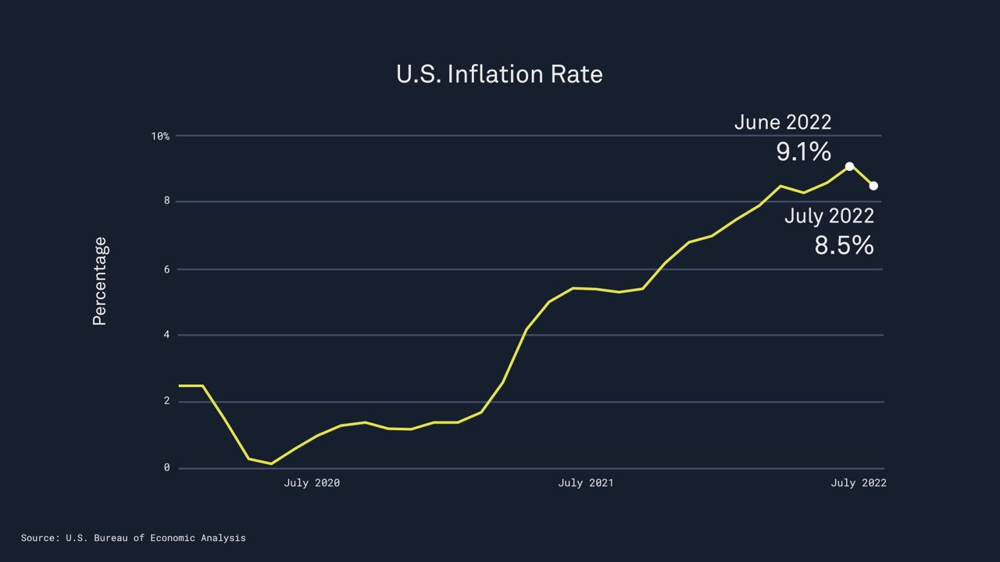</kbd>
</a>

🥫 <a href="https://www.pbs.org/newshour/economy/this-new-orleans-food-bank-opened-to-serve-more-people-now-inflation-is-forcing-them-to-turn-dozens-away">Inflation is forcing New Orleans food bank to turn dozens away </a>- Data reporting contribution:

<a href="https://www.pbs.org/newshour/economy/this-new-orleans-food-bank-opened-to-serve-more-people-now-inflation-is-forcing-them-to-turn-dozens-away">
  <kbd>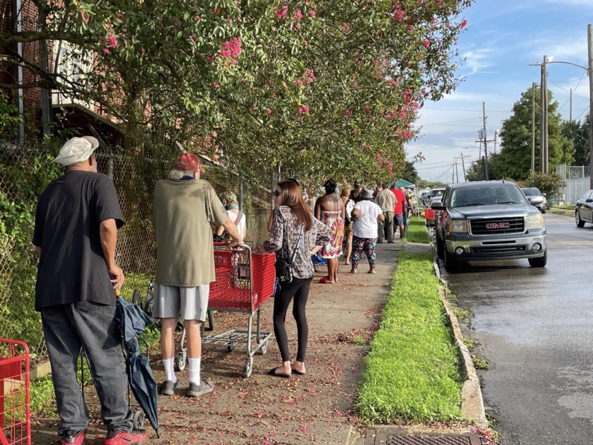</kbd>
</a>

🚙 <a href="https://www.pbs.org/newshour/nation/watch-catalytic-converter-thefts-are-skyrocketing-heres-why">Catalytic converter thefts are skyrocketing </a>- Still & animated data visualizations:

<a href="https://www.pbs.org/newshour/nation/watch-catalytic-converter-thefts-are-skyrocketing-heres-why">
  <kbd>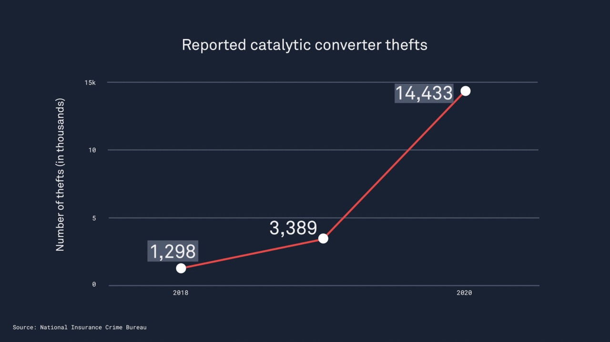</kbd>
</a>

🏠 <a href="https://www.pbs.org/newshour/nation/5-reasons-housing-is-so-expensive-right-now">5 reasons housing is so expensive right now </a>- Still & animated data visualizations:

<a href="https://www.pbs.org/newshour/nation/5-reasons-housing-is-so-expensive-right-now">
  <kbd></kbd>
</a>
