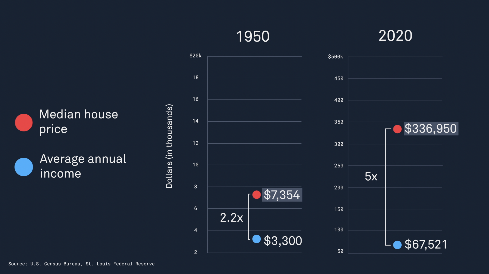
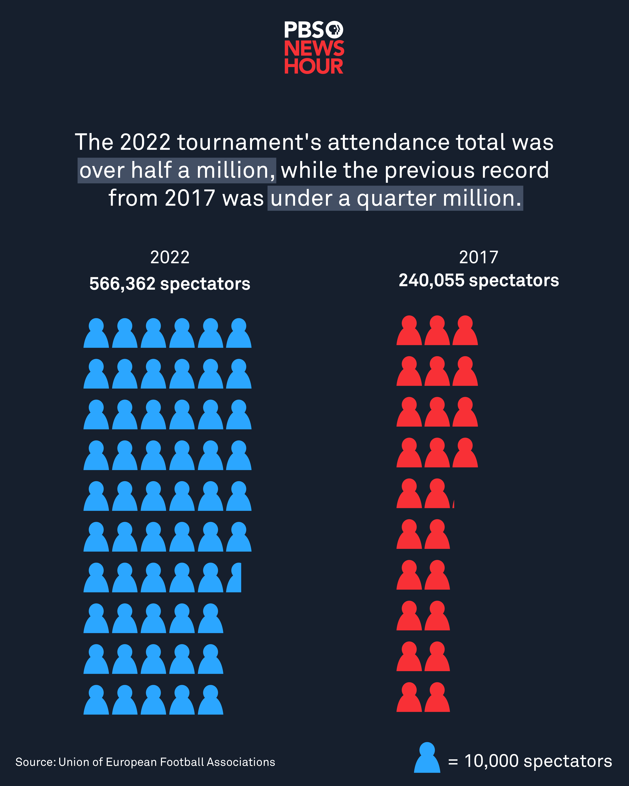
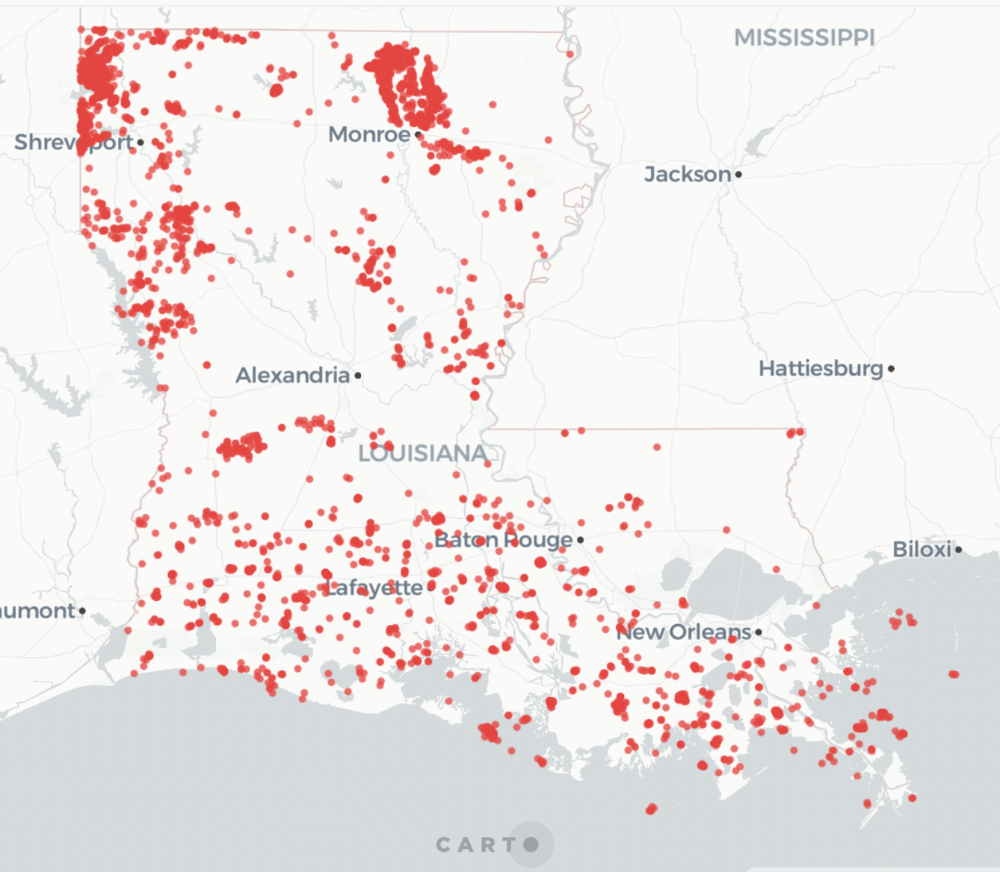

# PBS NewsHour: Data Reporting + Visualizations

⚽️ <a href="https://www.pbs.org/newshour/nation/5-reasons-housing-is-so-expensive-right-now">5 reasons housing is so expensive right now </a>- Still & animated data visualization:      

<a href="https://www.pbs.org/newshour/nation/5-reasons-housing-is-so-expensive-right-now">
  <kbd></kbd>
</a>

⚽️ <a href="https://www.instagram.com/p/Cgs5Px9uFr-/">UEFA Women's Euro 2022 Attendance </a>- Data visualization:      

<a href="https://www.instagram.com/p/Cgs5Px9uFr-/">
  <kbd></kbd>
</a>

📍 <a href="https://www.pbs.org/newshour/nation/in-louisiana-orphan-wells-seen-as-an-accident-waiting-to-happen">Orphaned oil and gas wells in Louisiana </a>- Map visualization:      

<a href="https://www.pbs.org/newshour/nation/in-louisiana-orphan-wells-seen-as-an-accident-waiting-to-happen">
  <kbd></kbd>
</a>  

- housing prices 
- cc theft
- NOLA food bank data contrib
- econ explainer
- cali grid